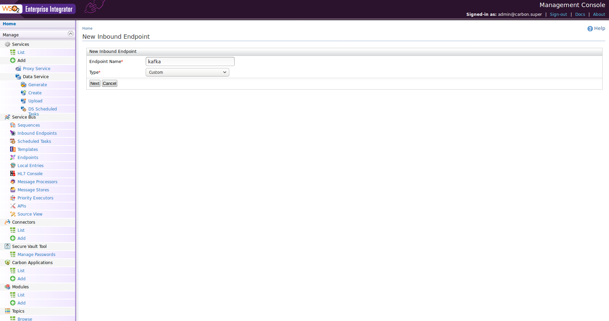
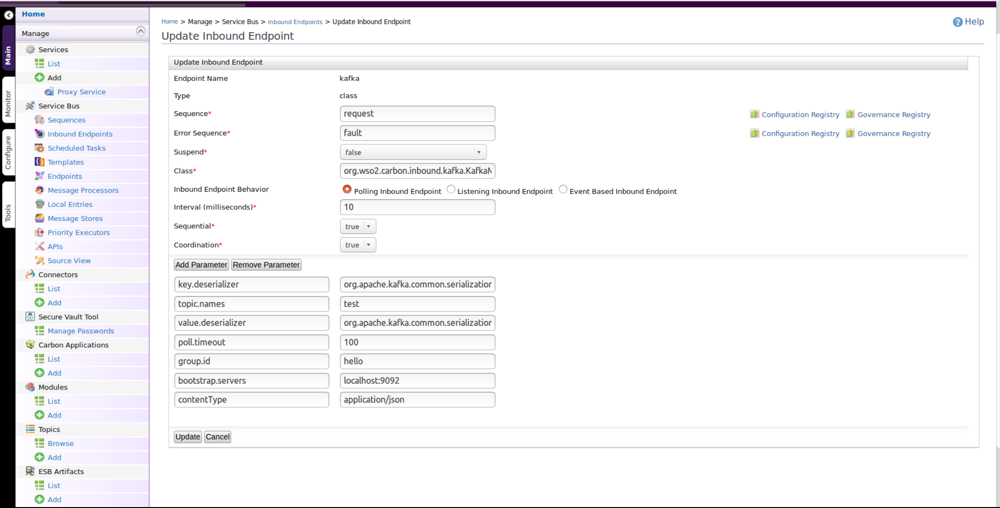
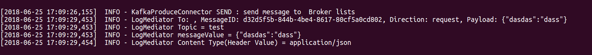

# Configuring the Kafka Inbound Operation

The Kafka inbound endpoint of WSO2 ESB acts as a message consumer. It creates a connection to ZooKeeper and requests messages for either a topic/s or topic filters.

Follow the steps below to configure the Kafka inbound endpoint to work with the ESB Profile of WSO2 EI:

- Download and install [Apache Kafka](http://kafka.apache.org/downloads.html).

>>The recommended version of Kafka for the Kafka inbound endpoint is [kafka_2.12-1.0.0](http://kafka.apache.org/downloads). For all available versions of Kafka, see [https://kafka.apache.org/downloads](https://kafka.apache.org/downloads).

- Download the kafka_2.12-1.0.0.tgz from [here](https://www.apache.org/dyn/closer.cgi?path=/kafka/1.0.0/kafka_2.12-1.0.0.tgz) and extract it. Let's call this directory <KAFKA_HOME>.

- Go to [https://store.wso2.com/store/assets/esbconnector/details/kafka](https://store.wso2.com/store/assets/esbconnector/details/b15e9612-5144-4c97-a3f0-179ea583be88), and click lick **Download Inbound Endpoint** to download the inbound JAR file and add the downloaded .jar file to the <EI_HOME>/dropins directory.

- Copy the following client libraries from <KAFKA_HOME>/lib to <EI_HOME>/wso2/components/lib.
                
* [kafka_2.12-1.0.0.jar](https://mvnrepository.com/artifact/org.apache.kafka/kafka_2.12/1.0.0)  
* [kafka-clients-1.0.0.jar](https://mvnrepository.com/artifact/org.apache.kafka/kafka-clients/1.0.0)
* [metrics-core-2.2.0.jar](https://mvnrepository.com/artifact/com.yammer.metrics/metrics-core/2.2.0)
* [scala-library-2.12.3.jar](https://mvnrepository.com/artifact/org.scala-lang/scala-library/2.12.3)
* [zkclient-0.10.jar](https://mvnrepository.com/artifact/com.101tec/zkclient/0.10)
* [zookeeper-3.4.10.jar](https://mvnrepository.com/artifact/org.apache.zookeeper/zookeeper/3.4.10)

Run the following command to start the ZooKeeper server:
    
    bin/zookeeper-server-start.sh config/zookeeper.properties
    
Run the following command to start the Kafka server:

    bin/kafka-server-start.sh config/server.properties
    
## Sample configuration

1. Given below is a sample Kafka configuration that can consume messages using a given topic/s:
    >>Note: This configuration does not include security.

    #### Inbound Configuration without security
    
    ```xml
    <inboundEndpoint xmlns="http://ws.apache.org/ns/synapse"
                     name="kafka"
                     sequence="request"
                     onError="fault"
                     class="org.wso2.carbon.inbound.kafka.KafkaMessageConsumer"
                     suspend="false">
       <parameters>
          <parameter name="sequential">true</parameter>
          <parameter name="interval">10</parameter>
          <parameter name="coordination">true</parameter>
          <parameter name="inbound.behavior">polling</parameter>
          <parameter name="value.deserializer">org.apache.kafka.common.serialization.StringDeserializer</parameter>
          <parameter name="topic.names">test</parameter>
          <parameter name="poll.timeout">100</parameter>
          <parameter name="bootstrap.servers">localhost:9092</parameter>
          <parameter name="group.id">hello</parameter>
          <parameter name="contentType">application/json</parameter>
          <parameter name="key.deserializer">org.apache.kafka.common.serialization.StringDeserializer</parameter>
       </parameters>
    </inboundEndpoint>
    ```
    
You can add the above inbound configuration via the WSO2 ESB Management Console as well:
    
* Click the Main tab on the Management Console and then go to Manage -> Service Bus and click Inbound Endpoints to open the Inbound Endpoints page.    
* On the Inbound Endpoints page, click Add Inbound Endpoint to open the New Inbound Endpoint page.
* Specify a name for the inbound endpoint, select the inbound protocol type as custom for the new inbound endpoint , and click Next.          
              
             

2. Given below is a sample Kafka configuration that can consume messages using a given topic/s :
    >>Note : This configuration includes security.
    
    #### Inbound configuration with security
    
    ```xml
    <inboundEndpoint xmlns="http://ws.apache.org/ns/synapse"
                     name="kafka"
                     sequence="request"
                     onError="fault"
                     class="org.wso2.carbon.inbound.kafka.KafkaMessageConsumer"
                     suspend="false">
       <parameters>
          <parameter name="interval">10</parameter>
          <parameter name="coordination">true</parameter>
          <parameter name="sequential">true</parameter>
          <parameter name="inbound.behavior">polling</parameter>
          <parameter name="value.deserializer">org.apache.kafka.common.serialization.StringDeserializer</parameter>
          <parameter name="topic.names">test</parameter>
          <parameter name="poll.timeout">100</parameter>
          <parameter name="bootstrap.servers">localhost:9092</parameter>
          <parameter name="group.id">hello</parameter>
          <parameter name="contentType">application/json</parameter>
          <parameter name="key.deserializer">org.apache.kafka.common.serialization.StringDeserializer</parameter>
          <parameter name="ssl.keystore.location">/home/hariprasath/Desktop/kafkaNewJira/certKafka/kafka.client.keystore.jks</parameter>
          <parameter name="security.protocol">SSL</parameter>
          <parameter name="ssl.truststore.location">/home/hariprasath/Desktop/kafkaNewJira/certKafka/kafka.client.truststore.jks</parameter>
          <parameter name="ssl.keystore.password">test1234</parameter>
          <parameter name="ssl.truststore.password">test1234</parameter>
          <parameter name="contentType">application/json</parameter>
       </parameters>
    </inboundEndpoint>
    ```
    
    >> Note: Make sure you provide the `sequential` and `coordination` parameters as shown in the above configuration.
    
### Kafka inbound endpoint parameters

Given below are the descriptions of all possible parameters that you can set in a Kafka configuration:

| Parameter | Description | Required | Possible values |
| ------------- | ------------- | ------------- | ------------- |
| bootstrap.servers | A list of host or port pairs that you can use to establish the initial connection to the Kafka cluster | Yes | localhost:9092, localhost:9093 |
| key.deserializer | The deserialiser class for the key that implements the Deserializer interface | Yes | class |
| value.deserializer | The deserialiser class for the value that implements the Deserializer interface | Yes | class |
| topic.names | A comma-separated list of topic names to consume the messages | Yes | String |
| group.id | The unique string that identifies the consumer group that a consumer belongs to | Yes | String |
| contentType | The message content type | Yes | application/json, application/xml, text/plain |
| pollTimeout | The amount of time to block the consumer to consume messages | Yes | Long |
| ssl.keystore.location | The location of the keystore file. Specifying this is optional for the client and can be used in two-way authentication for the client | Required for security enabled configurations | String |
| ssl.keystore.password | The password for the keystore file. Specifying this is optional for the client and is only required if the ssl.keystore.location parameter is configured | Required for security enabled configurations | Password |
| ssl.truststore.location | The location of the truststore file | Required for security enabled configurations | String |
| ssl.truststore.password | The password for the truststore file. **Note :** If you do not set a password, access to the truststore will still be available but integrity checking will be disabled | Required for security enabled configurations | Password |
| security.protocol | The protocol used to communicate with brokers. Possible values are: PLAINTEXT, SSL, SASL_PLAINTEXT, SASL_SSL | Required for security enabled configurations | SSL, PLAINTEXT |
| max.poll.records | The maximum number of records returned in a single call to poll. | Required for throttling | Integer |

For more information on Kafka configuration parameters, see the [Kafka Documentation](https://kafka.apache.org/documentation/#newconsumerconfigs).

### Enabling security for Kafka producers and consumers

For information on how to enable TLS authentication for Kafka brokers, producers, and consumers, see [Enabling Security](enableSecurity.md).

### Working with Kafka clients/producers

Kafka versions 0.9.0.0 and above support TLS. Enabling security for Kafka producers and consumers is a matter of configuration. It does not require any code changes.

##### TLS

The parameters required to support TLS is the same for both producers and consumers. As you are using mutual authentication, you should give the security protocol as well as the truststore and keystore information.

Let's see how to use a Kafka producer to start producing messages. First, either start the console producer or use the Kafka connector to produce the message. You can start the producer with or without security.

To start the console producer without security, execute the following command. Alternatively, you can use the Kafka connector without security.

    bin/kafka-console-producer.sh --broker-list localhost:9092 --topic test

To start the console producer with security, execute the following command. Alternatively, you can use the Kafka connector with security.

    kafka-console-producer –broker-list localhost:9092 –topic test –producer.config {file-path}/producer_ssl.properties

Use the following configuration to enable security for the console producer:

    security.protocol=SSL
    ssl.truststore.location={file-path}/kafka.client.truststore.jks
    ssl.truststore.password=test1234
    ssl.keystore.location={file-path}/kafka.client.keystore.jks
    ssl.keystore.password=test1234
    ssl.key.password=test1234

>>**Note:** If the passwords are stored in the client configuration, it is important to restrict access to the file via filesystem permission.

Send the following message using the console producer or the Kafka connector:

    {"test":"wso2"}
    {"test":"wso2"}
    {"test":"wso2"}
    
### Configuring the sample scenario  
    
Create a sample sequence as follows:

```xml
<sequence xmlns="http://ws.apache.org/ns/synapse" name="request" onError="fault">
   <log level="full"/>
   <log level="custom">
      <property xmlns:ns="http://org.apache.synapse/xsd"
                name="partitionNo"
                expression="get-property('partitionNo')"/>
   </log>
   <log level="custom">
      <property xmlns:ns="http://org.apache.synapse/xsd"
                name="messageValue"
                expression="get-property('messageValue')"/>
   </log>
   <log level="custom">
      <property xmlns:ns="http://org.apache.synapse/xsd"
                name="offset"
                expression="get-property('offset')"/>
   </log>
</sequence>
```

Create a sample fault sequence as follows:

```xml
<sequence xmlns="http://ws.apache.org/ns/synapse" name="fault">
   <log level="full">
      <property name="MESSAGE" value="Executing default 'fault' sequence"/>
      <property xmlns:ns="http://org.apache.synapse/xsd"
                name="ERROR_CODE"
                expression="get-property('ERROR_CODE')"/>
      <property xmlns:ns="http://org.apache.synapse/xsd"
                name="ERROR_MESSAGE"
                expression="get-property('ERROR_MESSAGE')"/>
   </log>
   <drop/>
</sequence>
```  

### Testing the sample scenario

After a message is produced using the console producer or the connector, the debug log of the ESB displays an INFO message as follows:


### Configuring the sample scenario with Kafka record headers

First, you need to pass Kafka record header with your Kafka message.
The following sample assumes that the header name is [KAFKA_HEADER_NAME] and Kafka message topic is [KAFKA_TOPIC_NAME]
  
Create a sample sequence as follows:

```xml
<sequence xmlns="http://ws.apache.org/ns/synapse" name="request" onError="fault">
   <log level="full"/>
   <log level="custom">
      <property xmlns:ns="http://org.apache.synapse/xsd"
                name="Topic"
                expression="get-property('topic')"/>
   </log>
   <log level="custom">
      <property xmlns:ns="http://org.apache.synapse/xsd"
                name="messageValue"
                expression="get-property('messageValue')"/>
   </log>
   <log level="custom">
      <property xmlns:ns="http://org.apache.synapse/xsd"
                name="Content Type(Header Value)"
                expression="get-property('[KAFKA_TOPIC_NAME].[KAFKA_HEADER_NAME]')"/>
   </log>
</sequence>
```

Now you can view the header as a log in the termial as follows.

